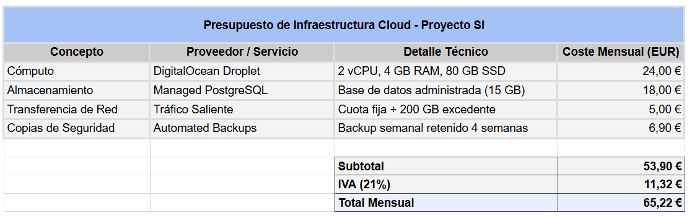

# El Marco Legal y la Estructura del "Relato"

## Pablo Garcia Rojas

## 1º DESARROLLO DE APLICACIONES MULTIPLATAFORMA

## FECHA: 15/05/2026

[**1\. Análisis de necesidades**](#análisis-de-necesidades)

[2\. ¿Qué problema de la empresa resolvemos con Guacamole y Docker?](#¿qué-problema-de-la-empresa-resolvemos-con-guacamole-y-docker?)

[3\. ¿Por qué elegimos esta solución y no conectar directamente por RDP a cada máquina?](#¿por-qué-elegimos-esta-solución-y-no-conectar-directamente-por-rdp-a-cada-máquina?)

[**2. Estimación de Costes de Infraestructura**](#análisis-de-necesidades)

## 

## 1.  Análisis de necesidades

   

**2.  ¿Qué problema de la empresa resolvemos con Guacamole y Docker?**

   Podemos resolver problemas como el acceso y el orden a las máquinas de nuestra empresa. Antes nos conectabamos por RDP directamente al equipo entonces hacia que tuviéramos problemas como los siguientes: demasiados puertos abiertos, credenciales repartidas por todas partes, cero control sobre quién entra a qué máquina y una experiencia de uso nada unificada.  
     
   Para solucionarlo, usamos Apache Guacamole en docker. Apache Guacamole hace que el usuario solo entra a una ulr y desde ahi el usuario pueda acceder a todas las máquinas que tenga permitidas. No necesita instalar clientes RDP, ni guardar credenciales, ni abrir puertos en cada equipo. Todo pasa por un único punto controlado.  
     
   Usando Apache Guacamole podemos ganar diferentes ámbitos como:  
* **Mayor centralización total:** un único portal para todas las conexiones remotas.  
* **Más seguridad:** dejamos de exponer puertos RDP máquina por máquina; solo se expone Guacamole.  
* **Gestión de permisos más seria:** usuarios, grupos y accesos controlados desde un único sitio.  
* **Ahorro de tiempo y recursos:** menos configuraciones, menos mantenimiento, menos problemas.  
* **Escalabilidad:** al estar en Docker, podemos actualizar, mover o duplicar el servicio sin complicaciones.  
  

**3. ¿Por qué elegimos esta solución y no conectar directamente por RDP a cada máquina?**

Porque es inseguro, difícil de gestionar y también es muy poco práctico. Cada máquina tendría que abrir su puerto, cada técnico tendría que guardar credenciales y no habría forma real de auditar accesos. Además, cada cliente RDP funciona distinto según el sistema operativo, lo que complica el soporte.

Con Guacamole todo se estandariza: una sola interfaz, una sola puerta de entrada y un control centralizado de quién accede a qué.

## 2. Estimación de Costes de Infraestructura
Se ha realizado una estimacion de nuestros costes en infraestructura basado en DigitalOcean Droplet.
En la siguiente imagen, se muestra el presupuesto realizado en una hoja de calculo, realizado con diferentes funciones de esta como pueden ser calcular el subtotal, IVA, etc...

## 3. Estrategia de Despliegue y Comunicación
Para pasar nuestro código desde los ordenadores de casa al servidor real de DigitalOcean vamos a utilizar **SFTP (SSH File Transfer Protocol)** ya que toda la conexión va cifrada de extremo a extremo a través del puerto 22 usando las claves SSH, por lo que es mucho más seguro. Además, si configuramos el SFTP nos servirá por si queremos automatizar los despliegues directamente desde nuestro repositorio.[1]

Nuestro equipo va a utilizar **Discord** para comunicarse las incidencias técnicas o las alertas automáticas que podamos recibir. Dentro de nuestro discord vamos a tener un bot automático conectado a las alertas del servidor. Si la máquina se cae, se queda sin espacio en el disco o la CPU se pone a más del 85%, el bot nos mandará un mensaje instantáneo a nuestro canal de discord para que podamos arreglar el problema antes de que los usuarios se den cuenta.

## 4. Justificación Científica

